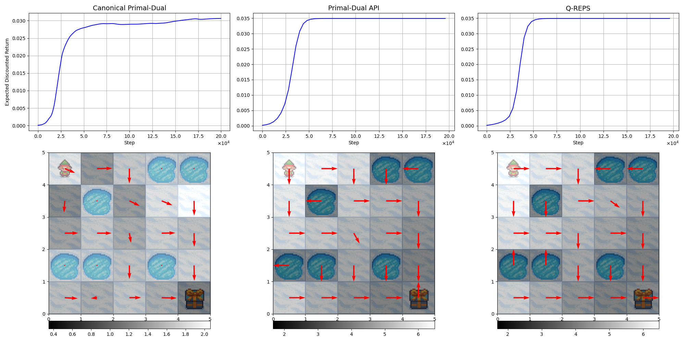
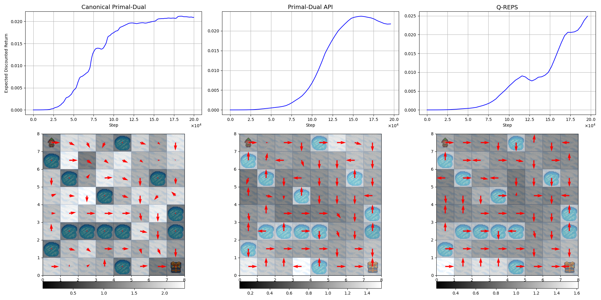

# Entropy-RL-Linear-Programming

## About this work
In this work, we aim to investigate the applicability of regularized LP-based RL algorithms. Our objectives include developing a practical implementation of Q-REPS using deep neural networks (DNNs), and understanding the impact of various practical design choices on the algorithm’s final performance through a large-scale empirical study using a slurm cluster. Additionally, we explore a novel primal-dual policy iteration algorithm.

## Requirements
```bash
python>=3.11
poetry==1.1.1
```
### Usage
```bash
poetry install
poetry run python main/algorithms/qreps/classic/elbe/qreps_elbe.py \
    --seed 1 \
    --env-id CartPole-v0 \
    --total-timesteps 50000

tensorboard --logdir runs
```

To use experiment tracking with wandb, run
```bash
wandb login # only required for the first time
poetry run python main/algorithms/qreps/classic/elbe/qreps_elbe.py \
    --seed 1 \
    --env-id CartPole-v0 \
    --total-timesteps 50000 \
    --track \
    --wandb-project-name qreps_test
```
or if using a config file, 
```bash
poetry run python algos/qreps/qreps_main.py \
    --config <path-to-config.json> \
    --track
```

## Q-REPS

### Algorithm definition
<div align="center">
    
    
</div>

#### Episodic Reward Curves


### Gameplay videos

### Gameplay videos

### Gameplay videos

<table>
  <tr>
    <td>
      
    </td>
    <td>
      
    </td>
    <td>
      
    </td>
  </tr>
</table>


### Slurm
We provide slurm files to submit jobs to a remote cluster in order to run the large scale experiments defined in this work. We provide both files to run array jobs of different parameter configurations, as well as a slurm job to create a Ray cluster, and perform hyperparameter optimization with HEBO or Optuna to find an optimal set of hyperparameters.

## Primal-Dual Approximate policy iteration

### Algorithm definition


### Policies and convergence curves





<!-- 
### XPPO


### XSAC


### XTD3

 -->
