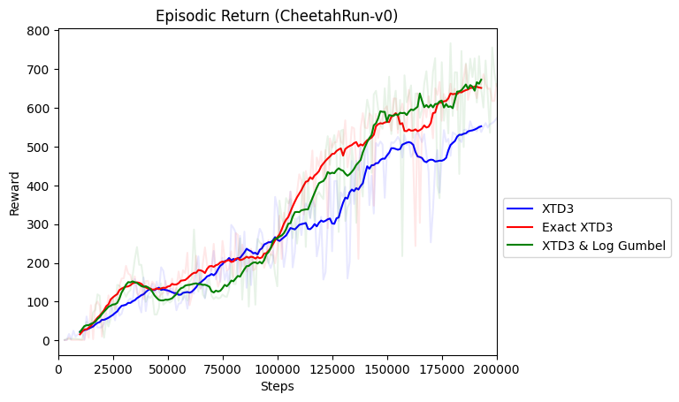

# Entropy-RL-Linear-Programming

## About this work
A study of regularized reinforcement learning algorithms from a Linear Programming framework. Specially studying the implementation of the QREPS algorithm in a large scale setting. Additionally, code for a new primal-dual policy iteration algorithm

## Requirements
```bash
python>=3.11
poetry==1.1.1
```
### Usage
```bash
poetry install
poetry run python main/algorithms/qreps/classic/elbe/qreps_elbe.py \
    --seed 1 \
    --env-id CartPole-v0 \
    --total-timesteps 50000

tensorboard --logdir runs
```

To use experiment tracking with wandb, run
```bash
wandb login # only required for the first time
poetry run python main/algorithms/qreps/classic/elbe/qreps_elbe.py \
    --seed 1 \
    --env-id CartPole-v0 \
    --total-timesteps 50000 \
    --track \
    --wandb-project-name qreps_test
```
or if using a config file, 
```bash
poetry run python algos/qreps/qreps_main.py \
    --config <path-to-config.json> \
    --track
```

### Q-REPS results

<div align="center">
    
    
</div>

- Episodic reward curves


- Gameplay videos
https://github.com/niicovila/Q-Reps/assets/76247144/4faa3bb3-72bb-4efd-b046-dd61b7bc2589
https://github.com/niicovila/Q-Reps/assets/76247144/9d9dafac-3cb7-447f-8b2c-9820b5701f5a

### Slurm
We provide slurm files to submit jobs to a remote cluster in order to run the large scale experiments defined in this work. We provide both files to run array jobs of different parameter configurations, as well as a slurm job to create a Ray cluster, and perform hyperparameter optimization with HEBO or Optuna to find an optimal set of hyperparameters.

### XPPO


### XSAC


### XTD3


